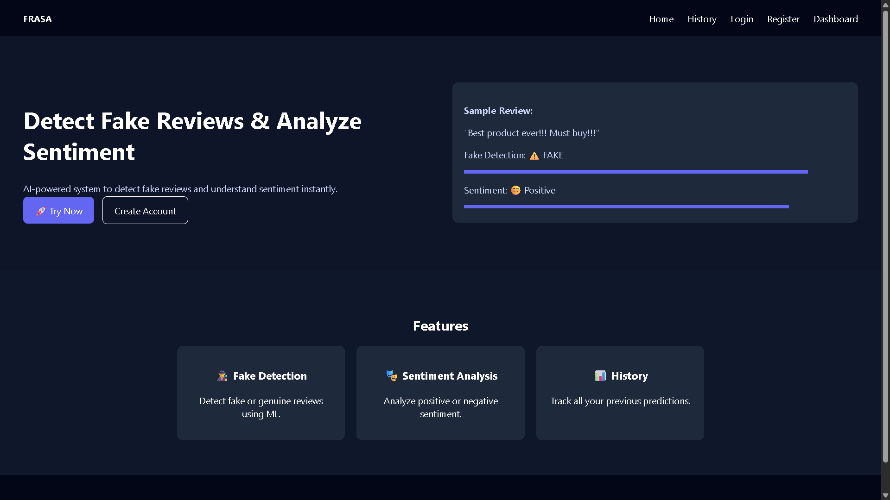
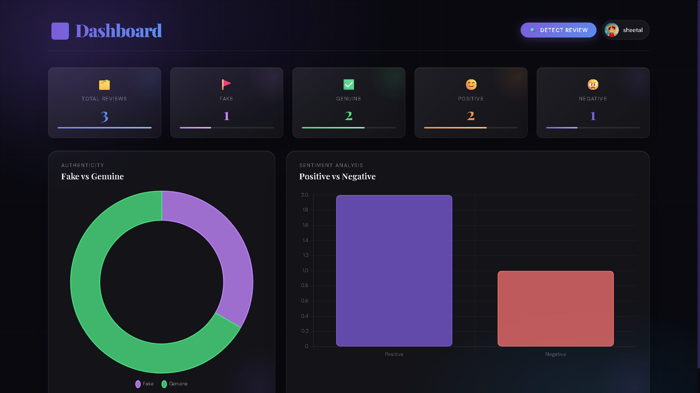
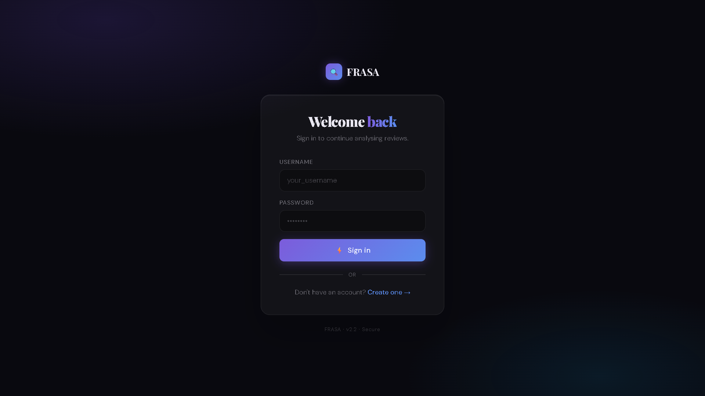
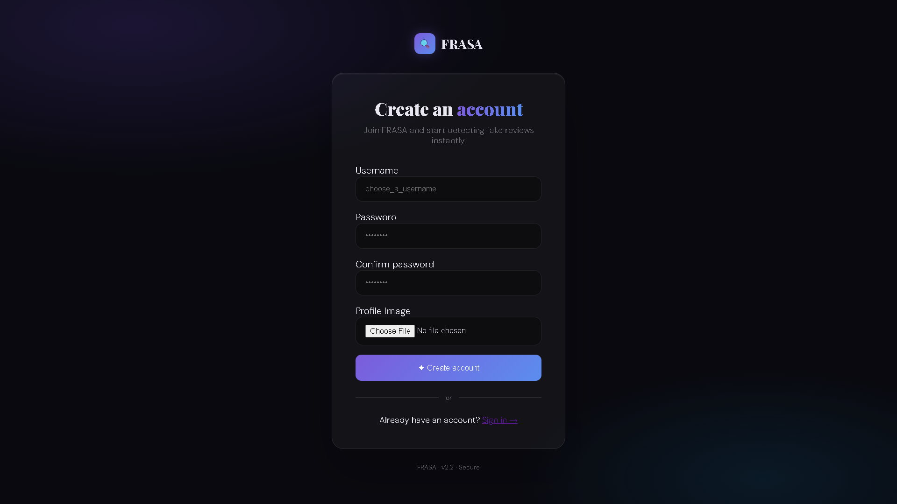

# FRASA — Fake Review Detection & Sentiment Analysis

<p align="center">
  <b>AI-powered fake review detection and sentiment analysis web application</b>
</p>

<p align="center">
  Built with Python, Django, Machine Learning and NLP
</p>

---

## 📌 About The Project

**FRASA** is a machine learning based web application designed to analyze online reviews and identify potentially fake reviews while also performing sentiment analysis.

The application combines **Natural Language Processing (NLP)**, **Machine Learning**, and **Django** to provide an interactive platform where users can submit reviews, analyze them, view predictions, and explore review statistics through a dashboard.

### What FRASA can do

- Detect whether a review is **Fake or Genuine**
- Perform **Sentiment Analysis**
- Provide prediction confidence
- Analyze individual reviews
- Analyze multiple reviews
- Store review history
- Display review statistics through a dashboard
- Provide user authentication
- Expose functionality through Django REST APIs

---

# ✨ Features

### 🔍 Fake Review Detection

Submit a review and the trained machine learning model predicts whether the review is:

- **Fake**
- **Genuine**

The application also provides prediction confidence.

### 😊 Sentiment Analysis

Analyze the sentiment of a review using a trained NLP model.

The system can identify the sentiment associated with the submitted review.

### 📦 Bulk Review Analysis

FRASA also supports analyzing multiple reviews through the bulk review functionality.

### 📊 Analytics Dashboard

The dashboard provides an overview of analyzed reviews and their statistics.

### 👤 User Authentication

The application includes:

- User Registration
- Login
- User-specific review history

### 🔌 REST API

The machine learning functionality is integrated with Django REST APIs, allowing the frontend to communicate with the backend prediction system.

---

# 📸 Screenshots

## 🏠 Home Page

The FRASA home page provides access to the review analysis functionality.



---

## 🔎 Review Checker

Users can submit a review and analyze it for fake/genuine classification and sentiment.


---

## 📦 Bulk Review Analysis

FRASA provides functionality for analyzing multiple reviews.


---

## 📊 Dashboard

The dashboard provides visual statistics and information about analyzed reviews.



---

## 🔐 Login

Users can securely log into their FRASA account.



---

## 📝 Registration

New users can create an account through the registration page.



---

# 🧠 Machine Learning

FRASA uses machine learning and NLP techniques for review classification and sentiment analysis.

## Fake Review Detection

Multiple classification algorithms were experimented with during model development:

- Logistic Regression
- Random Forest
- XGBoost
- Support Vector Machine
- Ensemble Model

## Sentiment Analysis

The sentiment analysis component uses:

- Multinomial Naive Bayes
- Linear Support Vector Classifier (LinearSVC)

---

# 📝 NLP Pipeline

The text processing pipeline includes techniques such as:

```text
Review Text
     │
     ▼
Text Cleaning
     │
     ▼
Lowercasing
     │
     ▼
Stopword Removal
     │
     ▼
Stemming
     │
     ▼
Feature Extraction
     │
     ├── Bag of Words
     │
     └── TF-IDF
     │
     ▼
Machine Learning Model
     │
     ▼
Prediction